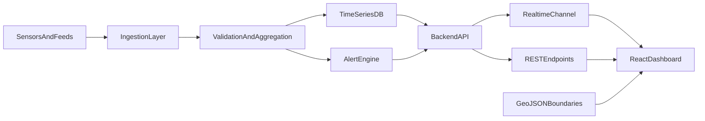

# Architecture

```mermaid
flowchart LR
  sensors[SensorsAndFeeds] --> ingest[IngestionLayer]
  ingest --> process[ValidationAndAggregation]
  process --> tsdb[TimeSeriesDB]
  process --> alertEngine[AlertEngine]
  tsdb --> api[BackendAPI]
  alertEngine --> api
  api --> ws[RealtimeChannel]
  api --> rest[RESTEndpoints]
  ws --> reactApp[ReactDashboard]
  rest --> reactApp
  geo[GeoJSONBoundaries] --> reactApp
```

## API Surface (MVP)

- `GET /api/readings/current`
- `GET /api/readings/history?from&to&type&zoneId`
- `GET /api/alerts`
- `PATCH /api/alerts/:id`
- `GET /api/events` (SSE)
